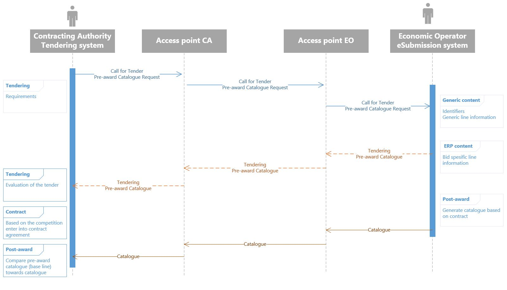

= Background

The Pre-award catalogue request is a tool for Contracting authorities (CA) to describe requirements and required characteristics for respectively of goods, services and works in a structured manner. A Pre-award catalogue request contains a generic description of the CA's needs. Based on the generic descriptions and requirements the economic operator (EO) creates a Pre-award catalogue based on their own assortment of goods, services or works to fulfil the requirements of the CA. Means of proof can be included and the evidence must be provided by EO in the pre-award catalogue.

Means for providing generic descriptions of requirements can be classifications systems such as UNSPSC, CPV or eCl@ss. These classification systems provide codes that codify classes of goods, services or works in a vendor-neutral manner. Furthermore, some of these classification systems codify properties of goods, services or works by providing property codes, for instances, codes for length, width or height of a goods.

Certification/conformity assessment of certain skills as surgical nurse, midwife, different kinds of engineers or other specialty of occupation can also be used. CA has stored the generic description and requirements via a Pre-award catalogue request in the tendering system, and and based on that Pre-award catalogue request an automated evaluation of the different offers (in shape of Pre-award catalogues) from different EO's can be performed. In this cases, the required skills are described in the Pre-award catalogue and the EO provides the means of proof in the Pre-award catalogue to proof that the required skills are provided.

In the evaluation process the pre-award catalogues will be stored. After signing the contract with EO, the pre-award catalogue can be transferred to the eProcurement system (catalogue tool) to be used as baseline. The purpose is to compare the electronic product catalogue towards the contract when or if the EOs update the catalogue.

Additionally, Pre-award catalogue requests can be used in a Dynamic Purchasing System (DPS) as a carrier of CAs needs towards suppliers qualified for the DPS supplier group. Automatically evaluation of incoming, tenders in the form of Pre-award catalogue, will save CA handling cost, as these Pre-award catalogues can be used to cross-check them with stored Pre-award catalogue request. DPS will also stimulate small and medium-sized enterprises (SME) to get involved in tenders because the needs can be more to the point and easier to handle.

Summarized, using electronic catalogues in the procurement processes will save processing time both for EO's and CA's and will enhance transparency and traceability of goods, services and works. To achieve good and effective processes, the EO should have their own eSubmission systems based on a 4-corner model to be able to communicate with different tendering platforms based on standard formats and PEPPOL eDelivery network.

This diagram illustrates the catalogue process:

.Diagram for the catalogue processes.

