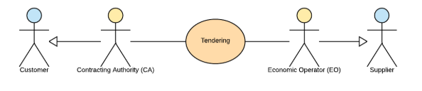

= The Pre-Award Catalogue Process and Typical Use Cases

== Pre-Award Catalogue and Request Diagram

.EHF Catalogue and request rolediagram.

== Use Cases Pre-Award Catalogue Request

=== Use case 1

In a tendering, certification/attestation of certain skills as surgical nurse, midwife, different kinds of engineers or other speciality of occupation are requested based on a formal list of these skills. The CA has stored the generic description and requirements from the pre-award catalogue request in the tendering system, and can undertake an automated evaluation of the different offers from different EO's with pre-award catalogue as a structured and standardized input.

In the evaluation process the pre-award catalogues will be stored. After signing the contract with awarded EO, the submitted pre-award catalogue can be transferred to the e-procurement system (catalogue tool) to be used as baseline for catalogue submitted later on. The purpose is to check the electronic product catalogue towards the contract when or if the EO updates the catalogue.

=== Use case 2

Pre-award catalogue request can be used in a Dynamic Purchasing System (DPS) as a carrier of CA needs towards suppliers qualified in to the DPS supplier group. Automatically evaluation of income, tender in the form of pre-award catalogue, will save CA handling cost. DPS will also stimulate SMB to get involved in tenders because the needs can be more to the point and easier to handle.

Using electronic catalogues in the tendering process will save processing time both for EO's and CA's and will enhance transparency and traceability of goods, services and works. To achieve efficient and effective processes, the EO should have their own e-submission systems based on a 4-corner model to be able to communicate with different tendering platforms based on standard formats.

=== Use case 3

A CA wants to buy goods, services or works that can be described easily. "Described easily" means that it is possible to specify the requirements on the products or services to be bought by the CA. Examples for such products are products for maintenance, repair and operations like office supplies. Standardized services can be different kind of substitute services for different kinds of professions. To describe the requirements contracting authority fill in pre-award catalogue request. The pre-award catalogue request specifies the requirements, e.g., the size and the thickness of the printer paper on the products in a structured and vendor-neutral manner.

After subscribing to a tender, an economic operator from Norway uses its tendering platform 123-Nor to receive the structured documents and store it in his system.  The system fill inn information about products and services, using information from the EO´s ERP system, in to pre-award catalogue, EPSD and other tender documents, and prepare for a submission of the tender. Contracting authority´s tendering platform ABC-Germania receive tendering documents and import the pre-award catalogue into the evaluation system and compare all received pre-award catalogues with each other and find the best tender of products or services automatically.

=== Use case 4

An EO finds an interesting business opportunity after a search on TED. The tender informs the EO that this is a Dynamic Purchasing System (DPS) process. EO must qualify into the system. First, the EO sends a subscription message to the contracting body to let them know that he is interested. This puts him on the list of interested economic operators. CA sends out the qualifications documents, ESPD request, and EO let his system fill out the ESPD response. EO send ESPD response and CA automatically evaluate the documents and sends a request to a public data base containing evidence. The result is positive, and CA qualify EO into the DPS.

When CA have a need for products or services he pic generic descriptions for the different requirements and the system create a pre-award catalogue request together with other structured tender documents containing more high-level requirements to EO included in the DPS.

The EO uses the pre-award catalogue request to match the requirements with the product specification in its own system for product information (or catalogue) management. As a result, the EO's retrieves a list of product/service information that he thinks fulfil the requirements and the system fill out pre-award catalogue. CA receive pre-award catalogue and automatically evaluate the tender's from EO's.  CA chose the winner and inform all the suppliers in the tender and then sends the contract for signing.

== Use Cases Pre-Award Catalogue

=== Use case 1

On behalf of many municipalities or governmental entities a central unit has been given the task to accomplish a tender for the group on office supplies.

The call for tender includes a structured pre-award catalogue request with the needs for the group. The economic operator (supplier) that prepares the tender downloads or receive the catalogue request as part of the tendering documents. The pre-award catalogue request is containing descriptions of product and services the group needs in a generic way, e.g. blue pen.

Supplier choose their own products or services that fulfills the requirement and make use of a supplier eSubmission system to fill out the requested information as product number, product description, UoM (unit of measure) code, price, link to pictures and labels for environmental and social labels if required and so on. They can reuse generic information the central unit has included in the pre-award catalogue request as classification codes as UNSPSC, CPV or eCl@ss.

After finalizing the pre-award catalogue they include the catalogue together with other structured documents as ESPD or non-structured documents as PDF in to the system. The system prepares for submission towards the tender systems by sending the bid package to the access point connected.

When contracting authority receive, through their access point, the pre-award catalogues from different suppliers, as part of the bid packages they lock down the offers. When time for open the bids, tendering system import the pre-award catalogue xml files in to their valuation service and find the best offer of products and/or services.

The central unit import the catalogue into their catalogue tool and check the quality. According to the contract the supplier is sending a post-award catalogue that’s compared towards the pre-award catalogue from the tender. When the catalogue is ok the central unit sends it out of their access point, based on a distribution list in the catalogue tool. The different municipalities or governmental entities is receiving the approved pre-award catalogue in their catalogue tool connected to their eProcurement system. When the catalogue already is approved, the system can automatically display the catalogue content in the eProcurement search engine used by the different entities buyers.