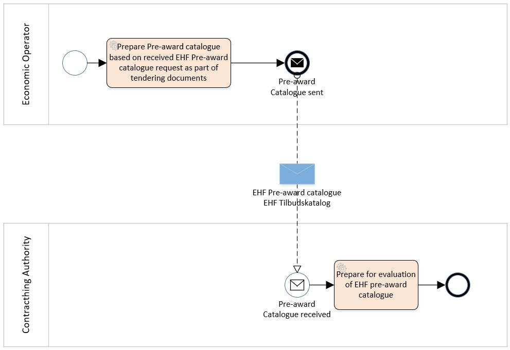

= The Pre-Award Catalogue and Catalogue Request Process and Typical Use Cases

{empty} +

== Pre-Award Catalogue

{empty} +

=== Process Diagram

The following diagram illustrates the basic EHF Pre-Award Catalogue process.

.EHF Pre-Award Catalogue process.

{empty} +

=== Use Case

//==== Use case

On behalf of many municipalities or governmental entities a central unit has been given the task to accomplish a tender for the group on office supplies.

The call for tender includes a structured pre-award catalogue request with the needs for the group. The economic operator (tenderer) that prepares the tender downloads or receive the catalogue request as part of the procurement documents. The pre-award catalogue request is containing descriptions of product and services the group needs in a generic way, e.g. blue pen.

Economic operators choose their own products or services that fulfills the requirement and make use of a supplier eSubmission system to fill out the requested information as product number, product description, UoM (unit of measure) code, price, link to pictures and labels for environmental and social labels if required and so on. If the contracting authority provided structured information on the required goods, services or works base on codified property systems, for instance, provided by classification systems like GPC or eCl@ss, the economic operator can use this information to retrieve the necessary data on the offered goods, services or works from their product information systems. Futhermore, by using the aforementioned classification systems they can provide these product information in a structured way as well, so that it facilitates the automatic procession and evaluation of the tender.

After finalizing the pre-award catalogue they include the catalogue together with other structured documents or non-structured documents as PDF into the system. The system prepares for submission towards the tender systems by sending the bid package to the access point connected.

When contracting authority receive, through their access point, the pre-award catalogues from different tenderers, as part of the bid packages they lock down the offers. When time for open the bids, tendering system import the pre-award catalogue xml files in to their valuation service and find the best offer of products and/or services.

The central unit import the catalogue into their catalogue tool and check the quality. According to the contract the supplier is sending a post-award catalogue that’s compared towards the pre-award catalogue from the tender. When the catalogue is ok the central unit sends it out of their access point, based on a distribution list in the catalogue tool. The different municipalities or governmental entities is receiving the approved pre-award catalogue in their catalogue tool connected to their eProcurement system. When the catalogue already is approved, the system can automatically display the catalogue content in the eProcurement search engine used by the different entities buyers.

== Pre-Award Catalogue Request

{empty} +

=== Process Diagram

The following diagram illustrates the basic EHF Pre-Award Catalogue Request process.

.EHF Pre-Award Catalogue Request process.
image::images/catalogueRequestDiagram.png[align="center",900,900]

{empty} +

=== Use Cases

==== Use case 1

Certification/conformity assessment of certain skills as surgical nurse, midwife, different kinds of engineers or other specialty of occupation can also be used. CA has stored the generic description and requirements via a Pre-award catalogue request in the tendering system, and based on that Pre-award catalogue request an automated evaluation of the different offers (in shape of Pre-award catalogues) from different economic operators can be performed. In this cases, the required skills are described in the Pre-award catalogue and the economic operator provides the means of proof in the Pre-award catalogue to proof that the required skills are provided.

In the evaluation process the pre-award catalogues will be stored. After signing the contract with EO, the Pre-award catalogue can be transferred to the eProcurement system (catalogue tool) to be used as baseline to compare the catalogue to the contract, if the catalogue is updated by the economic operator.

==== Use case 2

Pre-award catalogue requests can be used in a Dynamic Purchasing System (DPS) as a carrier of contracting authorities needs towards suppliers qualified for the DPS supplier group. Automatically evaluation of incoming, tenders in the form of Pre-award catalogue, will save contracting authority handling cost, as these Pre-award catalogues can be used to cross-check them with stored Pre-award catalogue request. DPS will also stimulate small and medium-sized enterprises (SME) to get involved in tenders because the needs are specified in a structured manner, easier to handle and can be used to create an offer in shape of a Pre-award catalogue automatically based on a Pre-award catalogue request.

==== Use case 3

A CA wants to buy goods, services or works that can be described easily. "Described easily" means that it is possible to specify the requirements on the products or services to be bought by the CA. Examples for such products are products for maintenance, repair and operations like office supplies. Standardized services can be different kind of substitute services for different kinds of professions. To describe the requirements contracting authority fill in pre-award catalogue request. The pre-award catalogue request specifies the requirements, e.g., the size and the thickness of the printer paper on the products in a structured and vendor-neutral manner.

After subscribing to a tender, an economic operator from Norway uses its tendering platform 123-Nor to receive the structured documents and store it in his system. The system fills the information on goods and services into the Pre-award catalogue using information from the economic operator's ERP system as well as procurement documents. Finally, the system prepares all theses documents for submission as a tender and submits it.

The contracting authorities tendering platform ABC-Germania receives the procurement documents and imports the Pre-award catalogue into the evaluation system and compare all received Pre-award catalogues with each other and the Pre-award catalogue requests to find the best tender of goods or services automatically.

==== Use case 4

An economic operator finds an interesting business opportunity after a search on a tendering platform. The tender informs the economic operator that this is a Dynamic Purchasing System (DPS) process. After passing the qualification to the DPS, the economic operator is able to receive requests for goods, services or work from contracting authority.

When contracting authority has a need for goods or services, it provides the  generic descriptions for the different requirements by creating a Pre-award catalogue request together with other structured tender documents containing more high-level requirements. These documents are made available in the DPS.

The economic operator uses the Pre-award catalogue request to match the requirements with the product specification in its own system for product information (or catalogue) management. As a result, the economic operator retrieves a list of goods/service information that fulfil the requirements and the system creates a Pre-award catalogue.

The contracting authority receives the Pre-award catalogue and automatically evaluate the tenders from the various economic operator. The contracting authority choses the winner and inform all participating economic operator and then sends the contract for signing to the winning economic operator.

The winning Pre-award catalogue will be then the basis for placing orders, receiving reception of goods and services and atomically checking of sent invoices.